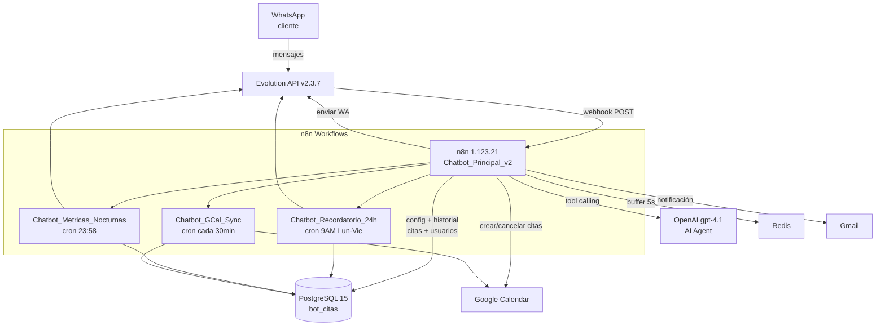

# Arquitectura del Sistema — ChatbotSKC

## Visión general

ChatbotSKC es un agente conversacional de WhatsApp para gestión de citas. Cada mensaje entra por Evolution API → n8n lo procesa con un LLM → responde y persiste el estado en PostgreSQL + Google Calendar.

---

## Diagrama de componentes



---

## Flujo de un mensaje entrante

```
1. WhatsApp → Evolution API → webhook POST /chatbot-principal
2. Webhook Response (inmediato, 200 OK) — evita duplicados por timeout
3. IF fromMe = true → STOP (anti-loop)
4. Redis: deduplica si el mismo key_id llegó en los últimos 5s
5. Postgres: verifica idempotencia por key_id (tabla mensajes)
6. IF duplicado → STOP
7. Cargar config empresa desde config_negocio
8. Detectar tipo de mensaje: texto / audio / imagen
   - Audio → Whisper transcription → texto
   - Imagen → gpt-4o-mini vision → descripción → texto
9. Upsert usuario (tabla usuarios) en paralelo
10. AI Agent (gpt-4.1) con tools: agendar_cita, cancelar_cita, consultar_citas
11. Revisar si el agente usó un tool de calendario
    - SI: Sync cita en BD (tabla citas) en paralelo
    - SI nueva cita: notificar admin WA + Gmail + grupo
12. Postgres Chat Memory actualiza historial (n8n_chat_histories)
13. Evolution API envía respuesta al usuario
```

---

## Schema de base de datos

```mermaid
erDiagram
    empresas {
        uuid id PK
        text nombre
        text zona_horaria
    }
    instancias_whatsapp {
        uuid id PK
        uuid empresa_id FK
        text evolution_instance_name
    }
    usuarios {
        uuid id PK
        uuid empresa_id FK
        text numero_whatsapp
        text numero_limpio
        text nombre
        estado_lead_enum estado_lead
        boolean baneado
    }
    sesiones {
        uuid id PK
        uuid usuario_id FK
        uuid empresa_id FK
        text session_key
        estado_sesion_enum estado
    }
    citas {
        uuid id PK
        uuid empresa_id FK
        uuid usuario_id FK
        text google_event_id
        timestamptz inicio
        timestamptz fin
        estado_cita_enum estado
        boolean recordatorio_enviado
        int version
    }
    mensajes {
        uuid id PK
        uuid empresa_id FK
        text key_id UNIQUE
        direccion_mensaje_enum direccion
        boolean procesado
    }
    config_negocio {
        uuid empresa_id FK
        text campo
        text valor
    }
    metricas_diarias {
        uuid empresa_id FK
        date fecha
        int citas_agendadas
        numeric tasa_conversion
    }
    error_log {
        uuid id PK
        uuid empresa_id FK
        text error_code
        boolean resuelto
    }

    empresas ||--o{ instancias_whatsapp : ""
    empresas ||--o{ usuarios : ""
    empresas ||--o{ citas : ""
    empresas ||--o{ mensajes : ""
    empresas ||--o{ config_negocio : ""
    usuarios ||--o{ citas : ""
    usuarios ||--o{ sesiones : ""
```

---

## Decisiones de diseño clave

| Decisión | Razón |
|---|---|
| `gpt-4.1` obligatorio para tool calling | `gpt-4o-mini` falla silenciosamente en tool use |
| Webhook Response inmediato | Sin esto, Evolution API retransmite → duplicados |
| `fromMe === false` como primera condición | Sin esto el bot entra en loop respondiendo sus propios mensajes |
| `key_id` UNIQUE en mensajes | Idempotencia garantizada a nivel BD |
| `tstzrange` + GiST index en citas | Detecta overlap de citas en O(log n) concurrentemente |
| `pairedItem: { item: 0 }` en Formatear config | Sin esto el workflow explota downstream al iterar |
| Config en Postgres, no Google Sheets | Google Sheets tiene quota de 300 req/min; Postgres no |
| `onError: continueRegularOutput` en Calendar tools | Permite manejar errores del agente sin romper el flujo |
| `contextWindowLength: 20` en Chat Memory | Aumentado de 10 para mejor contexto conversacional |

---

## Multi-tenancy

El sistema está diseñado para múltiples empresas. El routing por empresa se hace via `instancias_whatsapp.evolution_instance_name` (valor: `'SKC'` para ZURA Solutions). Todas las queries filtran por `empresa_id` derivado de ese campo.

Para agregar un segundo cliente: insertar en `empresas`, `instancias_whatsapp`, `config_negocio` y crear una nueva instancia en Evolution API.

---

## Sub-workflows

| Workflow | Trigger | Descripción |
|---|---|---|
| `Chatbot_Recordatorio_24h` | Cron `0 9 * * 1-5` | Envía WA a clientes con cita en ≤24h sin recordatorio |
| `Chatbot_Metricas_Nocturnas` | Cron `58 23 * * *` | Calcula métricas del día, reporta al admin/grupo |
| `Chatbot_GCal_Sync` | Cron `*/30 * * * *` | Detecta cambios en Google Calendar y sincroniza `citas` |
