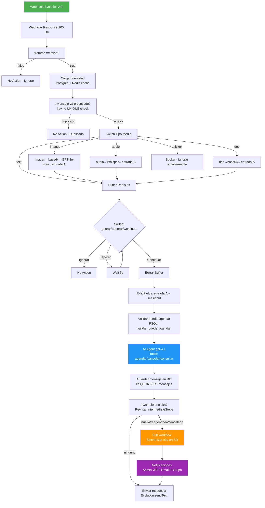
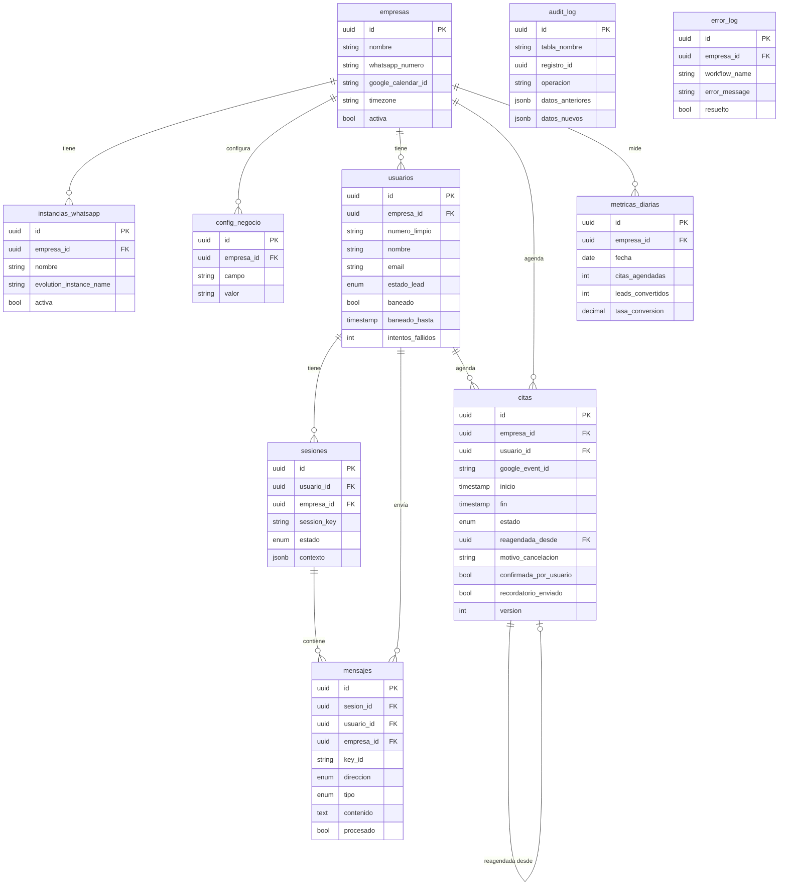

# Arquitectura de Workflows n8n — Sistema Unificado
> ChatbotSKC | ZURA Solutions | Generado: 2026-05-07

---

## DIAGRAMA GENERAL



---

## SUB-MÓDULO A: RECEPCIÓN Y VALIDACIÓN DE MENSAJES

### Qué hace
Es el portero del sistema. Recibe TODOS los webhooks de Evolution API, responde
inmediatamente con 200 OK (anti-duplicado), y decide si el mensaje debe procesarse.

### Por qué es necesario
Sin el 200 OK inmediato, Evolution API reintenta el webhook hasta 3 veces si n8n
tarda en responder. Esto crea duplicados de procesamiento.

### Nodos requeridos

```
[Webhook]
  path: aa0cdd49-6d3b-4a28-a690-7be70d4ffe70
  method: POST
  responseMode: responseNode

[Webhook Response] ← conectar PRIMERO desde Webhook
  respondWith: json
  responseBody: {"status":"ok"}
  ← Este nodo debe ser el PRIMER output del Webhook

[Code: Obtener Datos]
  // Extraer campos del payload de Evolution API
  const body = $input.first().json.body;
  return [{json: {
    number:   body.data.key.remoteJid,
    name:     body.data.pushName,
    key_id:   body.data.key.id,
    fromMe:   body.data.key.fromMe,
    text:     body.data.message?.conversation || '',
    image_url: body.data.message?.imageMessage?.url || '',
    audio_url: body.data.message?.audioMessage?.url || '',
    doc_url:   body.data.message?.documentMessage?.url || '',
    fecha:    body.data.messageTimestamp,
    instance: body.instance
  }}]

[IF: fromMe == false]
  condition: $json.fromMe === false
  true  → continuar
  false → No Action (bot ignorándose a sí mismo)

[Postgres: Verificar idempotencia]
  query: SELECT id FROM mensajes WHERE key_id = $1 LIMIT 1
  params: [$json.key_id]
  → Si retorna fila: No Action (duplicado)
  → Si vacío: continuar

[Postgres: Guardar mensaje entrada]
  query: |
    INSERT INTO mensajes (empresa_id, usuario_id, key_id, direccion, tipo, contenido, metadata)
    VALUES (
      (SELECT id FROM instancias_whatsapp WHERE evolution_instance_name = $1 LIMIT 1),
      NULL, -- se actualiza después con upsert_usuario
      $2, 'entrada', 'texto', $3,
      jsonb_build_object('instance', $1, 'from_name', $4)
    )
    ON CONFLICT (key_id) DO NOTHING
    RETURNING id
  params: [$json.instance, $json.key_id, $json.text, $json.name]
```

### Casos de error
- `fromMe = true`: ignorado silenciosamente (No Action)
- `key_id` duplicado: ignorado silenciosamente (idempotencia)
- Empresa/instancia no encontrada: insertar en `error_log` y parar

---

## SUB-MÓDULO B: CARGAR IDENTIDAD DE EMPRESA

### Qué hace
Reemplaza la llamada a Google Sheets por una query a PostgreSQL con cache Redis.
Construye el contexto completo de config para el sistema prompt del AI Agent.

### Por qué es necesario
Google Sheets tiene quotas de API que se saturan con tráfico alto. PostgreSQL
es local y sub-milisegundo. Redis cache evita incluso esa latencia para mensajes consecutivos.

### Nodos requeridos

```
[Redis: Get config cache]
  operation: get
  key: config:empresa:{{ $json.empresa_id }}
  → Si existe: usar directamente (cache hit)
  → Si null: ir a Postgres

[Postgres: Cargar config] (solo si cache miss)
  query: SELECT get_config_empresa($1::uuid)
  params: [$json.empresa_id]

[Code: Formatear config]
  // Misma lógica que el Formatear config actual, pero leyendo desde Postgres
  const config = $input.first().json.get_config_empresa;
  // ... parsear campos
  return [{json: { ...config, pairedItem: {item: 0} }}]

[Redis: Set config cache]
  operation: set
  key: config:empresa:{{ $json.empresa_id }}
  value: {{ JSON.stringify($json) }}
  expire: 300  // 5 minutos TTL
```

### Interacción
El objeto config que sale de este módulo es consumido por:
- El system prompt del AI Agent
- El filtro modo_prueba
- Las validaciones de horario
- Las notificaciones al admin

---

## SUB-MÓDULO C: VALIDACIÓN DE USUARIO

### Qué hace
Crea o actualiza el perfil del usuario. Verifica si puede agendar (no baneado,
no demasiados intentos, empresa activa).

### Nodos requeridos

```
[Postgres: Upsert usuario]
  query: SELECT upsert_usuario($1::uuid, $2, $3, NULL, NULL, NULL, NULL, '{}')
  params: [empresa_id, $json.number, $json.name]

[Postgres: Validar puede agendar]
  query: SELECT validar_puede_agendar($1::uuid, $2::uuid)
  params: [empresa_id, usuario_id]

[IF: puede_agendar]
  condition: $json.validar_puede_agendar.puede === true
  false: enviar mensaje de "fuera de servicio" genérico
         (no revelar que está baneado)
```

### Casos de error
- Usuario baneado: respuesta genérica "en este momento no podemos atenderte"
- Demasiados intentos: incrementar contador y respuesta de cooldown

---

## SUB-MÓDULO D: OBTENER SLOTS DISPONIBLES (Tool del AI Agent)

### Qué hace
Cuando el AI Agent detecta intención de agendar, consulta PostgreSQL para obtener
horarios libres. Esto complementa (no reemplaza) la función `consultar_citas` de
Google Calendar.

### Por qué dos fuentes
- Google Calendar: fuente de verdad para el usuario y para el AI Agent
- PostgreSQL: validación adicional para overlap prevention y lógica de negocio

### Nodo: Tool personalizado para slots

```javascript
// n8n Code Tool: buscar_horarios_disponibles
// El AI Agent puede llamar esta tool en lugar de solo consultar_citas

const slots = await $postgres.query(`
  SELECT
    to_char(slot_inicio AT TIME ZONE 'America/Mexico_City', 'YYYY-MM-DD"T"HH24:MI:SS"-06:00"') AS inicio,
    to_char(slot_fin    AT TIME ZONE 'America/Mexico_City', 'YYYY-MM-DD"T"HH24:MI:SS"-06:00"') AS fin
  FROM buscar_slots_disponibles(
    $1::uuid,
    NOW(),
    NOW() + INTERVAL '7 days',
    $2::int,
    $3::time,
    $4::time,
    5
  )
`, [empresaId, duracionReunion, horarioInicio, horarioFin]);

return slots.map(s =>
  `📅 ${formatearFechaHumana(s.inicio)}`
).join('\n');
```

---

## SUB-MÓDULO E: CONFIRMACIÓN Y BOOKING

### Qué hace
Después de que el usuario confirma un horario, el AI Agent llama `agendar_cita`
en Google Calendar. Luego este módulo sincroniza la cita en PostgreSQL.

### Nodos requeridos (Post-AI Agent)

```
[Code: Detectar operación de cita]
  // Ya existe como "Revisar si se agendó"
  // Leer intermediateSteps del AI Agent
  // Detectar: nueva, reagendada, cancelada

[Postgres: Sincronizar cita] (si tipoEvento != 'ninguno')
  query: |
    SELECT CASE
      WHEN $1 = 'nueva' THEN
        registrar_cita($2::uuid, $3::uuid, $4, $5, $6, $7::timestamptz, $8::timestamptz, $9)::text
      WHEN $1 = 'reagendada' THEN
        reprogramar_cita($10, $4, $2::uuid, $5, $7::timestamptz, $8::timestamptz)::text
      WHEN $1 = 'cancelada' THEN
        cancelar_cita_bd($10, 'cancelada por usuario')::text
    END AS resultado
  params: [tipoEvento, empresa_id, usuario_id, google_event_id,
           calendar_id, titulo, inicio, fin, descripcion, event_id_viejo]
```

### Idempotencia garantizada
Si el workflow se ejecuta dos veces (retry), `registrar_cita` hace
`ON CONFLICT (google_event_id) DO UPDATE SET updated_at = NOW()`.
No hay citas duplicadas en PostgreSQL.

---

## SUB-MÓDULO F: ERROR HANDLING CENTRALIZADO

### Qué hace
Captura errores de cualquier nodo, los guarda en `error_log`, notifica al admin
y devuelve una respuesta amigable al usuario.

### Configuración n8n

Todo nodo crítico debe tener:
```
onError: "continueErrorOutput"  ← cambiar de continueRegularOutput
```

Y conectar el output de error a:

```
[Code: Capturar error]
  const err = $input.first().json.error || {};
  return [{json: {
    workflow_name: 'Chatbot_Principal',
    node_name:     $('nodoQuefalló').name,
    error_code:    err.code || 'UNKNOWN',
    error_message: err.message || String(err),
    contexto: {
      number:    $('Obtener Datos').first().json.number,
      key_id:    $('Obtener Datos').first().json.key_id,
      timestamp: new Date().toISOString()
    }
  }}]

[Postgres: Insertar error_log]
  query: |
    INSERT INTO error_log (empresa_id, workflow_name, node_name, error_code, error_message, contexto)
    VALUES ($1::uuid, $2, $3, $4, $5, $6::jsonb)
  params: [empresa_id, workflow_name, node_name, error_code, error_message, contexto_json]

[HTTP: Notificar admin error crítico]
  // Solo si el error es CRÍTICO (Google Calendar down, Postgres down)
  url: http://evolution.../message/sendText/{{ instance }}
  body: { number: numero_admin, text: "⚠️ Error en chatbot: " + error_message }
```

---

## SUB-MÓDULO G: GUARDAR CITA CON TRANSACCIÓN ATÓMICA

### Problema actual
Google Calendar y PostgreSQL se actualizan en dos pasos separados. Si falla
entre los dos, queda inconsistencia.

### Solución: Orden y compensación

```
Orden CORRECTO:
1. INSERT cita en PostgreSQL (status: 'pending_gcal')
   → Si falla: ROLLBACK automático, no se creó nada, informar usuario
2. POST a Google Calendar API
   → Si falla: UPDATE cita SET estado='cancelada' en PG, informar usuario
3. UPDATE cita en PostgreSQL con google_event_id obtenido
   → Si falla: DELETE el evento de Google Calendar (compensación)
              → UPDATE cita SET google_event_id = id_de_google

Implementación n8n:
[Postgres: Pre-reservar slot] → [Google Calendar: Crear evento] → [Postgres: Confirmar con event_id]
                                    ↓ error
                               [Postgres: Cancelar pre-reserva]
                               [Notificar usuario: "Hubo un problema, intenta de nuevo"]
```

### Código Code node: Orquestador transaccional

```javascript
// n8n Code node: ejecutar_booking_transaccional
const datos = $input.first().json;
const { empresa_id, usuario_id, inicio, fin, titulo, descripcion } = datos;

// Paso 1: Pre-reservar en BD (sin google_event_id aún)
const preReserva = await $postgres.query(`
  INSERT INTO citas (empresa_id, usuario_id, titulo, descripcion, inicio, fin, estado)
  VALUES ($1::uuid, $2::uuid, $3, $4, $5::timestamptz, $6::timestamptz, 'pendiente')
  RETURNING id
`, [empresa_id, usuario_id, titulo, descripcion, inicio, fin]);

const cita_bd_id = preReserva[0].id;

return [{json: { ...datos, cita_bd_id, pre_reserva_ok: true }}];
```

---

## SUB-MÓDULO H: CONFIRMACIÓN AUTOMÁTICA 24H

### Qué hace
Trigger diario que busca citas para mañana, envía recordatorio por WhatsApp
y espera respuesta del usuario.

### Workflow separado: `Chatbot_Recordatorio_24h`

```
[Cron: 9:00 AM diario]
  cronExpression: 0 9 * * 1-5  // Lunes a Viernes 9am

[Postgres: Citas sin recordatorio en próximas 24h]
  query: |
    SELECT c.*, u.numero_limpio, u.nombre, i.evolution_instance_name
    FROM v_proximas_citas c
    JOIN usuarios u ON c.usuario_id = (SELECT usuario_id FROM citas WHERE id = c.id LIMIT 1)
    JOIN instancias_whatsapp i ON c.empresa_id = i.empresa_id
    WHERE c.inicio BETWEEN NOW() AND NOW() + INTERVAL '25 hours'
      AND c.recordatorio_enviado = false

[SplitInBatches: Procesar de a 5]
  batchSize: 5

[HTTP: Enviar recordatorio vía Evolution]
  body: |
    {
      "number": "{{ $json.numero_limpio }}",
      "text": "¡Hola {{ $json.usuario_nombre }}! 👋\nTe recordamos tu cita mañana:\n📅 {{ formatearFecha($json.inicio) }}\n¿Confirmas tu asistencia? Responde SÍ o NO"
    }

[Postgres: Marcar recordatorio enviado]
  query: |
    UPDATE citas
    SET recordatorio_enviado = true, recordatorio_at = NOW()
    WHERE id = $1::uuid
  params: [$json.cita_id]
```

### Manejo de respuesta de confirmación
El AI Agent detecta "sí" o "no" en el contexto de recordatorio y llama a:
```sql
UPDATE citas SET confirmada_por_usuario = true, confirmada_at = NOW()
WHERE usuario_id = $usuario_id AND estado = 'pendiente'
  AND inicio BETWEEN NOW() AND NOW() + INTERVAL '25 hours';
```

---

## SUB-MÓDULO I: SINCRONIZACIÓN GOOGLE CALENDAR → POSTGRESQL

### Qué hace
Si alguien cancela o modifica un evento directamente desde Google Calendar
(el admin), el sistema se entera y actualiza PostgreSQL + notifica al usuario.

### Configuración requerida
1. En Google Calendar API → activar Channel Notifications (Push)
2. URL del webhook: `https://[n8n]/webhook/gcal-sync`

### Workflow: `Chatbot_GCal_Sync`

```
[Webhook: gcal-sync]
  // Google Calendar envía X-Goog-Resource-State header

[HTTP: Obtener detalle del evento]
  url: https://www.googleapis.com/calendar/v3/calendars/{{ calendarId }}/events/{{ eventId }}
  → Obtener estado actual del evento

[IF: Estado es 'cancelled']
  → Cancelar en PostgreSQL
  → Buscar usuario por número en description del evento
  → Enviar notificación al usuario: "Tu cita fue cancelada..."

[IF: Estado cambió de hora]
  → Actualizar inicio/fin en PostgreSQL
  → Notificar usuario del cambio
```

---

## SUB-MÓDULO J: CANCELACIÓN Y REAGENDAMIENTO

### Mejora sobre el sistema actual
El sistema actual delega TODO al AI Agent. El sistema propuesto hace que el
AI Agent detecte la intención y confirme, pero la ejecución real la hace n8n
con transacciones.

### Flujo mejorado de cancelación

```
[AI Agent] detecta "cancelar cita"
  → Tool: consultar_citas (Google Calendar) para obtener event_id
  → Responde al usuario con resumen y pide confirmación
  → Usuario confirma con "sí"

[Code: Detectar cancelación confirmada en output]
  // Si intermediateSteps contiene cancelar_cita con observation exitosa

[Postgres: cancelar_cita_bd]
  query: SELECT cancelar_cita_bd($1, $2)
  params: [google_event_id, motivo_cancelacion]

[Postgres: Reset intentos si había fallo]
  query: UPDATE usuarios SET intentos_fallidos = 0 WHERE id = $1::uuid
```

---

## SUB-MÓDULO K: RATE LIMITING Y ANTI-ABUSE

### Problema no resuelto en el sistema actual
No hay límite de mensajes por usuario. Un bot puede enviar 1000 mensajes/min,
generando 1000 llamadas a OpenAI (costo ilimitado).

### Implementación en n8n

```javascript
// Code node: verificar rate limit
const { numero_limpio, empresa_id } = $input.first().json;
const key = `ratelimit:${empresa_id}:${numero_limpio}`;

// Obtener contador de Redis
const count = await $redis.get(key) || 0;

if (parseInt(count) >= 10) {  // 10 mensajes por ventana
  return [{json: { rate_limited: true, mensaje: 'Demasiados mensajes' }}];
}

// Incrementar y setear TTL de 1 minuto
await $redis.incr(key);
await $redis.expire(key, 60);  // ventana de 1 minuto

return [{json: { rate_limited: false }}];
```

---

## SUB-MÓDULO L: MÉTRICAS Y REPORTES

### Workflow: `Chatbot_Metricas_Nocturnas`

```
[Cron: 11:58 PM diario]
  cronExpression: 58 23 * * *

[Postgres: Calcular métricas del día]
  query: SELECT calcular_metricas_diarias($1::uuid, CURRENT_DATE)
  params: [empresa_id]

[Code: Generar reporte texto]
  const m = $input.first().json;
  return [{json: {
    reporte: `
📊 Reporte del ${m.fecha}

💬 Mensajes: ${m.total_mensajes_entrada} recibidos
👥 Usuarios: ${m.usuarios_nuevos} nuevos | ${m.usuarios_activos} activos
📅 Citas: ${m.citas_agendadas} agendadas | ${m.citas_canceladas} canceladas
💰 Conversión: ${m.tasa_conversion}%
    `.trim()
  }}]

[Gmail: Enviar reporte al admin]
[HTTP Evolution: Enviar reporte al admin por WA]
```

---

## SUB-MÓDULO M: GESTIÓN DE MULTI-TENANT

### Para escalar a múltiples clientes

La instancia de Evolution API (`body.instance`) determina qué empresa es.

```javascript
// Al inicio del workflow (después de Obtener Datos):
const instancia = $json.instance;  // Ej: "Isaac", "ZURA_Ventas"

// Query para resolver empresa desde instancia
const empresa = await $postgres.query(`
  SELECT i.empresa_id, e.nombre, e.google_calendar_id
  FROM instancias_whatsapp i
  JOIN empresas e ON i.empresa_id = e.id
  WHERE i.evolution_instance_name = $1 AND i.activa = true
`, [instancia]);

if (!empresa.length) {
  // Instancia desconocida - loggear y parar
  throw new Error(`Instancia desconocida: ${instancia}`);
}

return [{json: { ...datos, empresa_id: empresa[0].empresa_id }}];
```

---

## VARIABLES GLOBALES N8N RECOMENDADAS

Configurar en n8n → Settings → Variables:

```
EMPRESA_ID_ZURA        = a0000000-0000-0000-0000-000000000001
EVOLUTION_BASE_URL     = http://evolution_evolution-api:8080
POSTGRES_DB_NAME       = n8n  (o el nombre de tu BD)
GCAL_TIMEZONE          = America/Mexico_City
BUFFER_WINDOW_SECONDS  = 5
RATE_LIMIT_MAX_MSG     = 10
RATE_LIMIT_WINDOW_SEC  = 60
RECORDATORIO_HORAS     = 24
```

---

## CONFIGURACIÓN DE ERROR HANDLING GLOBAL

En cada sub-workflow crítico, activar el nodo "Error Trigger":

```
[Error Trigger]
  → [Code: Formatear error]
  → [Postgres: INSERT error_log]
  → [IF: Es crítico?]
      → [HTTP: Notificar admin]
```

Cambiar en todos los nodos de Calendar:
```
onError: "continueErrorOutput"  ← NO "continueRegularOutput"
```

Esto expone el error al flujo en lugar de silenciarlo.

---

## DIAGRAMA ER COMPLETO


